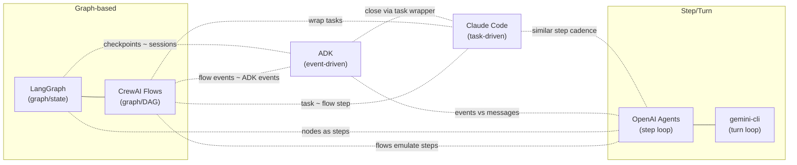
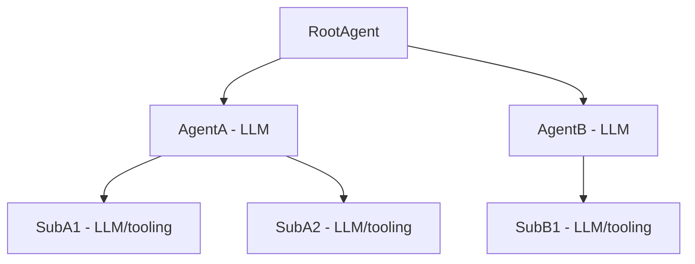
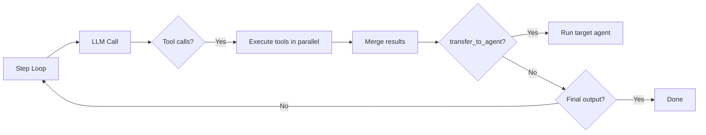
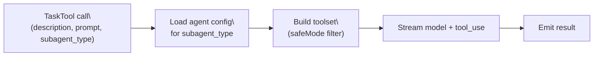
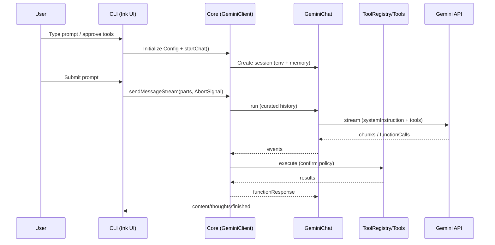
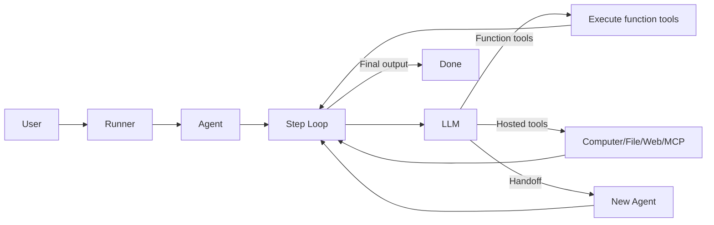
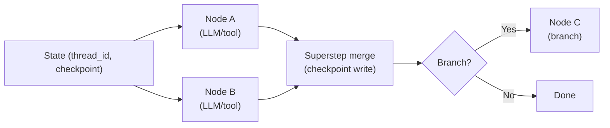
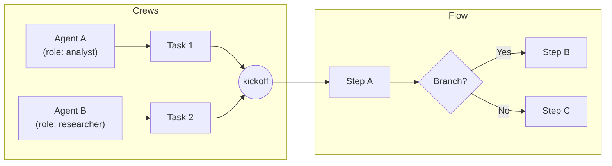

# AI Agent Framework Comparison & Analysis

## About

Compare and analyze top AI agent frameworks to help developers choose the right orchestration approach for their use cases.

## What's Inside

This repository contains analysis and examples of the following packages:

- gemini-cli
- adk-python (Agent Development Kit)
- Claude Code
- openai-agents-python (OpenAI Agents SDK)

Each section outlines the purpose, core components, orchestration flow, tools integration, memory/session handling, streaming/interruptions, and key entry points with code references.

Note
- Claude Code and gemini-cli are applications (not general-purpose agent frameworks). They are referenced here because their core capabilities — safe, permissioned tool execution; human-in-the-loop approvals; and rich streaming UX — are generally only achievable by embedding a built-in agent orchestration layer.

Table of Contents
- Quick Compare (Capabilities)
- Orchestration Diagrams (Mermaid)
- Apps (Reference Implementations)
  - App: gemini-cli
  - App: Claude Code
- Frameworks
  - Framework: ADK (Python)
  - Framework: LangGraph (Python)
  - Framework: CrewAI (Python)
  - Framework: OpenAI Agents (Python)
- Context Model: What Reaches The LLM
- Tracing & Spans
- Appendix: Examples and Docs
---

## Capabilities Matrix (Quick Compare)

- Language/Runtime
  - gemini-cli: Node/TypeScript (CLI + core)
  - adk-python: Python
  - openai-agents-python: Python
  - Claude Code: Node/TypeScript (terminal app)
  - langgraph: Python
  - crewAI: Python

- Primary Use Case
  - gemini-cli: Local dev assistant with safe tool use, IDE companion
  - adk-python: Enterprise multi-agent apps (Gemini/Vertex), live A/V
  - openai-agents-python: Provider-agnostic agent apps with hosted tools + tracing
  - Claude Code: Claude Code-style terminal assistant implementation
  - langgraph: Durable, stateful agent graphs with HITL
  - crewAI: Multi-agent automation via Crews and event-driven Flows

- Multi-Agent Model
  - gemini-cli: Non-interactive subagents that emit outputs
  - adk-python: Sequential/Parallel agents; transfer_to_agent
  - openai-agents-python: Handoffs; Agent-as-tool
  - Claude Code: `subagent_type` selects specialized agents; parallel-safe tools
  - langgraph: Graph of nodes (LLM/tools) with routers/supervisors
  - crewAI: Crews (role-based agents) + Flows (event-driven DAG)

- Tools & Integrations
  - gemini-cli: Code/file, shell, web fetch/search, MCP; confirmations built-in
  - adk-python: BaseTool, OpenAPI/app integration, Google auth, code executors
  - openai-agents-python: Function tools + hosted tools (file/web/computer/MCP)
  - Claude Code: Tool registry, per-tool UI, MCP client/approvals
  - langgraph: Works with LangChain ecosystem; LangSmith for tracing/evals
  - crewAI: Built-in tool system, event bus, flow persistence & visualization

- Human-in-the-Loop
  - gemini-cli: `shouldConfirmExecute` + CLI dialogs; approval modes; sandbox
  - adk-python: Synthetic confirmation/consent function calls (+ plugins)
  - openai-agents-python: MCP approval callbacks, computer safety, guardrails
  - Claude Code: Permission prompts per tool; modes (standard/bypass), safeMode; MCP approvals
  - langgraph: Native breakpoints/state inspection for HITL
  - crewAI: Hooks/guardrails/callbacks; HITL implemented at app/control-plane

- Streaming/Realtime
  - gemini-cli: Streamed turns; queued input; cancellation
  - adk-python: Live A/V, reconnection, transcription, streaming tools
  - openai-agents-python: Step engine with realtime tools and events
  - Claude Code: Streaming via `query(...)` with tool_use/text and interrupts
  - langgraph: Node-level streaming; resume from checkpoints
  - crewAI: Event-driven steps; agents/tools stream via model integrations

- Sessions/Memory
  - gemini-cli: Hierarchical memory (memport), auto-compression
  - adk-python: Session services (in-memory/DB/Vertex), state deltas
  - openai-agents-python: Sessions + tracing spans
  - Claude Code: Message logs, memory tools for persistence
  - langgraph: Checkpoint stores (memory/SQLite) + working/long-term memory
  - crewAI: Flow state persistence (SQLite) + event history

- Delivery/UX
  - gemini-cli: CLI app, VSCode companion, optional A2A server
  - adk-python: Library + web server; telemetry/plugins
  - openai-agents-python: Library + examples; tracing UI integration
  - Claude Code: Terminal UI app with permission dialogs
  - langgraph: Library + LangSmith UI
  - crewAI: Library + optional control plane

- Strengths
  - gemini-cli: Safe local automation; strong developer UX
  - adk-python: Rich orchestration + enterprise features
  - openai-agents-python: Simple, flexible, provider-agnostic
  - Claude Code: Practical implementation of Claude-style workflow and HITL
  - langgraph: Durable execution, HITL, and state-first design
  - crewAI: Blend of autonomy (crews) and control (flows)

- Tradeoffs
  - gemini-cli: TS/Node, Gemini-centric; not a backend framework
  - adk-python: Heavier; tied to `google.genai` types; client UI needed for HITL
  - openai-agents-python: HITL beyond MCP/computer is app-driven
  - Claude Code: TS/Node; tailored to terminal UX; less general than a framework
  - langgraph: More plumbing; graph/state design required; best with LangSmith
  - crewAI: Concurrency & HITL policies are app-driven; multiple patterns to choose

---

## Orchestration Diagrams (Mermaid)

### Orchestration Similarity Map (Mermaid)

Only comparing orchestration style (not features, tooling, or UX).



Notes
- LangGraph and CrewAI Flows are both graph/DAG orchestrators.
- OpenAI Agents (step) and gemini-cli (turn) share a per-iteration cadence.
- Claude Code (task) sits between ADK (event) and OpenAI (step): a thin “task” layer on ADK gets very close; Claude Code tasks often feel step-like in cadence.
- Legend: solid line — same family; dotted line — conceptual similarity.

### ADK (Hierarchical Agent Tree)





Context: InvocationContext persists across steps; ToolContext is created per tool call.

Advantages
- Clear parent→child control flow; global policies and state at the root.
- Built-in transfer between agents; strong composition (sequential/parallel).
- Rich HITL patterns (confirm/consent) and plugins; live A/V support.

Limitations
- Heavier to configure; steeper learning curve for flows/sessions/plugins.
- Tight coupling to ADK types; requires client layer to handle HITL I/O.
- Deep trees can be harder to reason about without good tracing/UX.

Concurrency
- Subagents: `ParallelAgent` runs child agents concurrently; `SequentialAgent` runs them in order.
- Tools: Function tool calls for a single step execute in parallel (`asyncio.gather`).
- Hosted tools: Computer and local-shell actions are intentionally serialized (stateful side effects).
- Live: Multiple streaming tools tracked via `active_streaming_tools`; fan-out from `LiveRequestQueue`.

### Claude Code (Per‑Task Subagent Selection)



Note: No persistent root tree; each task selects an agent type on demand.

Advantages
- Simple mental model: pick a subagent per task; fast to iterate.
- Explicit permission prompts; safeMode for read-only toolsets; strong UX.
- Easy parallelism for independent tasks; good terminal developer fit.

Limitations
- No long-lived root/graph to coordinate multi-step cross-task strategies.
- Orchestration logic lives in the TaskTool; fewer “framework” guarantees:
  - Lifecycle: no standardized before/after hooks for every step/tool at a framework layer; you wire critical checks into TaskTool/tools.
  - State: session/state persistence semantics are app-driven (logs + memory tools) rather than enforced by a session service.
  - Reliability: retries/timeouts/circuit breakers are not centrally configured; error handling tends to live at tool/query call sites.
  - Scheduling: no central resource/concurrency scheduler; parallel tasks can oversubscribe without app-level guards.
  - Policy: access controls/rate limits/quotas are app-specific; no root policy engine for cross-task governance.
  - Observability: primary signals are logs/sidechains; cross-task correlation requires custom stitching (no uniform OTEL traces).
- Tracing is log/sidechain oriented (no OTEL spans out of the box).

Concurrency
- Tasks: `TaskTool.isConcurrencySafe()` allows multiple TaskTool runs in parallel.
- Tools: Each tool can declare concurrency safety; safeMode filters reduce risk for concurrent runs.
- Caveat: No central scheduler/limits; concurrency control is app/UI driven.

### Gemini CLI (Turn & Tools)



Advantages
- Opinionated, safe tool confirmations with sandbox and CLI/IDE UX.
- Strong memory handling (memport + auto-compression) for coding workflows.
- Subagents for unattended decomposition within strict non-interactive bounds.

Limitations
- Non-interactive subagents only; broader multi-agent graphs not the focus.
- Node/TS runtime; less turnkey for Python backends/microservices.
- HITL beyond built-in approval modes requires working within CLI patterns.

Concurrency
- Tool calls within a turn are handled sequentially by the CLI loop; no built-in parallel tool execution per turn.
- Subagents can be created and run from host code concurrently (separate `SubAgentScope`s), but there is no built-in parallel subagent runner.
- A2A/server or external orchestrators can coordinate concurrent tasks; core prioritizes safety/approval over concurrency.

### OpenAI Agents (Step Loop, Tools, Handoffs)



Advantages
- Lightweight model with handoffs, hosted tools, guardrails, sessions.
- Provider-agnostic and easy to extend with hooks and function tools.
- Clear step loop and tracing helpers for observability.

Limitations
- HITL beyond MCP/computer safety is app-driven (you build the flow).
- No built-in hierarchical agent tree; composition via handoffs/tools.
- Structured output and policies are per-agent; cross-agent policy orchestration is custom.

Concurrency
- Tools: Function tool calls run concurrently within a step; results are aggregated.
- Hosted tools: Computer and local-shell calls are executed serially to preserve environment state.
- Handoffs: Control is single-lane; only one active agent after a handoff. Parallel agents can be run from your application if desired.

### LangGraph (Durable Graph Execution)



Note: State‑first design with durable checkpoints; independent nodes without dependencies can run concurrently per superstep.

### CrewAI (Crews + Flows)



Note: Crews provide collaborative autonomy; Flows provide event‑driven control with persistence. Independent flow branches can run concurrently.

### Orchestration Styles: Pros and Cons (Fixed Axes)

- Graph‑based (LangGraph):
  - Pros: explicit control flow; concurrency where edges allow; durable/resumable (checkpointing); easy to insert HITL breakpoints.
  - Cons: more upfront design (state/graph); added plumbing to map state→prompts; potential complexity for simple tasks.

- CrewAI (Crews + Flows):
  - Pros: blends agent autonomy (crews) with precise, persistent flows; event bus aids observability; guardrails/hooks enable pre‑LLM validation.
  - Cons: concurrency/scheduling not centrally managed; reconciling crew messages with flow state is app‑level; two paradigms increase design complexity.

- Event‑driven (ADK):
  - Pros: unified audit trail; native HITL via synthetic calls; deterministic merging of parallel tool results; strong replay/debug.
  - Cons: request assembly can grow/complex; requires processors to rearrange/merge; careful handling of internal identifiers.

- Task‑driven (Claude Code):
  - Pros: fast per‑task iteration; clear subagent selection; strong permissioned tool UX; simple mental model for users.
  - Cons: no persistent global graph; orchestration lives in the task tool; concurrency/scheduling/observability are app‑level.

- Step‑driven (OpenAI Agents):
  - Pros: simple loop semantics; easy tool parallelism within a step; clean separation of tool execution vs. model messages; good tracing hooks.
  - Cons: cross‑agent policy/state orchestration is custom; HITL beyond hosted tools requires app hooks; no built‑in hierarchical tree.

- Turn‑driven (gemini‑cli):
  - Pros: strong human‑in‑the‑loop gating for tools; curated message + environment context; stable tool declaration contract; excellent CLI/IDE UX.
  - Cons: non‑interactive subagents only; no built‑in parallel subagent runner; app‑specific (not a general SDK); streaming/approval events don’t reach the model.

## App: gemini-cli


Purpose: Interactive CLI and core runtime for Gemini-based agents with tools, subagents, memory discovery, and streaming UX.

Note: gemini-cli is an application and reference implementation, not a general-purpose agent framework. Its safety/HITL/streaming features rely on an embedded orchestration layer.

Key components:
- CLI UI and config wiring: `gemini-cli/packages/cli/index.ts:1`, `gemini-cli/packages/cli/src/gemini.tsx:1`, `gemini-cli/packages/cli/src/config/config.ts:1`
- Core client/session/turn: `gemini-cli/packages/core/src/core/client.ts:1`, `gemini-cli/packages/core/src/core/geminiChat.ts:1`, `gemini-cli/packages/core/src/core/turn.ts:1`
- Prompts/memory: `gemini-cli/packages/core/src/core/prompts.ts:1`, `gemini-cli/packages/core/src/utils/memoryDiscovery.ts:1`
- Tools: `gemini-cli/packages/core/src/tools/*`, `gemini-cli/packages/core/src/tools/tool-registry.ts:1`
- Subagents: `gemini-cli/packages/core/src/core/subagent.ts:1`
- Docs (structure): `gemini-cli/docs/code-structure.md:1`

Orchestration flow:
1) CLI initializes config and starts a chat session (env + memory).
2) User input triggers `sendMessageStream` which streams a turn through `GeminiChat`.
3) Model streams chunks: content, functionCalls, finishReason.
4) Core converts tool calls to confirmation requests; on approval, executes tool via `ToolRegistry`.
5) Tool results return as `functionResponse`; `GeminiChat` continues until finish.
6) UI renders content and manages queued inputs; cancellation propagates via `AbortSignal`.

Tools and confirmation:
- Tools are registered in `ToolRegistry` and exposed as function declarations.
- On tool request, core may emit a confirmation event unless configured to auto-approve.
- Tools execute with shared abort signaling; long-running tools respect cancellation.

Context & Invocation:
- Invocation unit: a Turn streams API chunks and yields events (`content`, `tool_call_request`, `finished`) bound to a `prompt_id`. See `gemini-cli/packages/core/src/core/turn.ts:152`.
- Session context: `GeminiChat` maintains curated history and generation config; `Config` supplies workspace, tools, model, approval, and telemetry. See `gemini-cli/packages/core/src/core/geminiChat.ts:1`, `.../config/config.ts:260`.
- Environment context: prepends OS/date/folder structure and optional full file context via tools. See `gemini-cli/packages/core/src/utils/environmentContext.ts:1`.
- Tool context: tool invocations receive `Config` (e.g., `targetDir`, allowlists); subagents validate tools up front to ensure no confirmations needed. See `gemini-cli/packages/core/src/tools/shell.ts:60`, `.../core/subagent.ts:300`.

Subagents:
- Non-interactive agents with scoped toolsets. Run with local prompts/models until outputs are emitted or limits reached. See `gemini-cli/packages/core/src/core/subagent.ts:1`.

Gemini Subagents (details):
- Configs: `PromptConfig` (systemPrompt or initialMessages), `ToolConfig.tools`, `OutputConfig.outputs`, `ModelConfig` (model/temp/top_p), `RunConfig` (max_time_minutes, max_turns?), `ContextState` for ${...} templating.
- API: `SubAgentScope.create(name, runtimeConfig, promptConfig, modelConfig, runConfig, options)`; `scope.runNonInteractive(context)`; results in `scope.output` with `emitted_vars` and `terminate_reason`.
- Emitting outputs: scope-local tool `self.emitvalue` is auto-exposed when outputs are expected; call it once per output key to fill `emitted_vars`.
- Tool safety: `create()` builds a per-scope `ToolRegistry` and rejects tools that require confirmation (non-interactive only). Tools share an `AbortSignal` for cancellation.
- Termination: `GOAL` (all outputs emitted), `MAX_TURNS`, `TIMEOUT`, `ERROR`.
- Stream loop: Streams chunks, accumulates `functionCalls`, executes tools, nudges the model to emit remaining outputs if it stops calling tools early.

Minimal usage example (TypeScript, single subagent):
```ts
import { Config, ApprovalMode, SubAgentScope, ContextState } from '@google/gemini-cli-core';

// Minimal runtime config
const runtimeConfig = new Config({
  sessionId: `demo-${Date.now()}`,
  model: 'gemini-2.5-pro',
  targetDir: process.cwd(),
  cwd: process.cwd(),
  debugMode: false,
  usageStatisticsEnabled: true,
  approvalMode: ApprovalMode.DEFAULT,
});

const scope = await SubAgentScope.create(
  'summarizer',
  runtimeConfig,
  {
    systemPrompt: 'Summarize ${topic} in 3 bullet points.',
  },
  { model: 'gemini-2.5-pro', temp: 0.3, top_p: 0.9 },
  { max_time_minutes: 2, max_turns: 8 },
  {
    toolConfig: { tools: ['web.search', 'fs.read'] },
    outputConfig: { outputs: { summary: 'concise bullet list' } },
    onMessage: (msg) => process.stdout.write(msg),
  },
);

const ctx = new ContextState();
ctx.set('topic', 'vector databases');

await scope.runNonInteractive(ctx);
console.log(scope.output.terminate_reason, scope.output.emitted_vars);
```

Multiple subagents (chaining two subagents):
```ts
import { Config, ApprovalMode, SubAgentScope, ContextState } from '@google/gemini-cli-core';

const cfg = new Config({
  sessionId: `demo-${Date.now()}`,
  model: 'gemini-2.5-pro',
  targetDir: process.cwd(),
  cwd: process.cwd(),
  debugMode: false,
  usageStatisticsEnabled: true,
  approvalMode: ApprovalMode.DEFAULT,
});

// Subagent A: research facts
const research = await SubAgentScope.create(
  'research',
  cfg,
  { systemPrompt: 'Research ${topic} and emit key_facts as JSON string.' },
  { model: 'gemini-2.5-pro', temp: 0.2, top_p: 0.95 },
  { max_time_minutes: 2, max_turns: 6 },
  {
    toolConfig: { tools: ['web.search', 'web.fetch'] },
    outputConfig: { outputs: { key_facts: 'JSON with concise facts' } },
  },
);

const ctxA = new ContextState();
ctxA.set('topic', 'RAG evaluation techniques');
await research.runNonInteractive(ctxA);

// Subagent B: compose draft using A's output
const compose = await SubAgentScope.create(
  'compose',
  cfg,
  { systemPrompt: 'Using ${key_facts}, write a 120-word summary.' },
  { model: 'gemini-2.5-pro', temp: 0.5, top_p: 0.9 },
  { max_time_minutes: 2, max_turns: 6 },
  {
    outputConfig: { outputs: { draft: '120-word summary' } },
  },
);

const ctxB = new ContextState();
ctxB.set('key_facts', research.output.emitted_vars.key_facts);
await compose.runNonInteractive(ctxB);

console.log({
  research: research.output.emitted_vars,
  compose: compose.output.emitted_vars,
});
```

Memory and compression:
- Hierarchical memory discovery with imports. Auto compression when token thresholds are met (snapshot+summary). See `memoryDiscovery.ts:520`, `client.ts:760`, `prompts.ts:346`.

Streaming and interruptions:
- Abort cancels turn and any in-flight tool execution. UI queues new instructions typed during streaming and submits when idle. See `turn.ts:229`, `packages/cli/src/ui/hooks/useMessageQueue.ts:1`.

Human‑in‑the‑Loop (HITL):
- Tool confirmations: Tools implement `shouldConfirmExecute(...)` that can return `ToolCallConfirmationDetails` to request approval. The core checks this and surfaces a confirmation to the UI. See `gemini-cli/packages/core/src/core/coreToolScheduler.ts:725` and `:1093`, and tool implementations like `packages/core/src/tools/shell.ts:70`, `edit.ts:239`.
- UI prompts: The CLI shows confirmation dialogs and routes the user’s decision back to the tool invocation. See `gemini-cli/packages/cli/src/ui/components/DialogManager.tsx:87` and `packages/cli/src/ui/AppContainer.tsx:1012` (confirmationRequest wiring).
- Modes: `--approval-mode` and `--yolo` toggle explicit approval vs. auto-approve; sandboxing is enabled for yolo by default. See `gemini-cli/docs/cli/configuration.md:462` and `:573`.
- A2A: When using the A2A server, confirmation events are emitted for clients to approve. See `gemini-cli/packages/a2a-server/development-extension-rfc.md:405`.

Entry points:
- Interactive session: `gemini-cli/packages/cli/src/gemini.tsx:1`
- Core streaming: `gemini-cli/packages/core/src/core/client.ts:480`
 - Subagents core: `gemini-cli/packages/core/src/core/subagent.ts:1`

---

## Framework: ADK (Python)


Purpose: Framework for building orchestrated agents (LLM-based and composites) with tools, planners, sessions, live/streaming, A2A (agent-to-agent), and plugins/telemetry.

Key components:
- Agent base and composites: `adk-python/src/google/adk/agents/base_agent.py:1`, `adk-python/src/google/adk/agents/llm_agent.py:1`, `adk-python/src/google/adk/agents/sequential_agent.py:1`, `adk-python/src/google/adk/agents/parallel_agent.py:1`
- Flows (LLM loop): `adk-python/src/google/adk/flows/llm_flows/base_llm_flow.py:1`, `adk-python/src/google/adk/flows/llm_flows/single_flow.py:1`, `adk-python/src/google/adk/flows/llm_flows/auto_flow.py:1`
- Function/tool handling: `adk-python/src/google/adk/flows/llm_flows/functions.py:1`
- Sessions: `adk-python/src/google/adk/sessions/session.py:1`, services in `sessions/*`
- Tools: `adk-python/src/google/adk/tools/*`, toolsets in `openapi_tool`, `application_integration_tool`
- A2A: `adk-python/src/google/adk/a2a/executor/a2a_agent_executor.py:1`

Orchestration flow (text mode):
1) `BaseAgent.run_async(parent_context)` creates an `InvocationContext` and executes before/after agent callbacks; core logic is in subclass `_run_async_impl`.
2) For `LlmAgent`, `_run_async_impl` delegates to an `BaseLlmFlow` (`single`/`auto`), which loops per-step until a final response/handoff.
3) Each step: preprocess request, call LLM (streaming or not), postprocess response, handle tool calls in parallel, optionally route to another agent via transfer, or produce final output.
4) Tools: `functions.handle_function_calls_async` resolves tool+context, runs plugin before/after callbacks, executes tool, builds function_response events, merges parallel results.
5) State deltas and actions (auth, confirmations, long-running) are accumulated in event actions for the session service to apply.

Live/streaming flow:
- `BaseLlmFlow.run_live` manages a bidirectional connection with reconnection via session resumption handle, request queue fan-out to active streaming tools, transcription managers for input/output audio, and output audio caching. See `base_llm_flow.py:1`.

Context & Invocation:
- Invocation unit: an `InvocationContext` represents one invocation (agent, branch, session, run_config, plugin_manager, live queues, streaming tool state, transcription caches). See `adk-python/src/google/adk/agents/invocation_context.py:92`.
- Step model: LLM flows run steps (one LLM call + optional tools) until final output or `transfer_to_agent`. See `adk-python/src/google/adk/flows/llm_flows/base_llm_flow.py:540`.
- Request assembly: request processors build `LlmRequest` contents from session history (rearrange/merge function responses) and add tools/instructions (e.g., structured output). See `.../llm_flows/contents.py:28`, `.../_output_schema_processor.py:27`.
- Tool context: tools execute with `ToolContext` (function_call_id, actions/state deltas, confirmation) derived from the `InvocationContext`, with before/after callbacks and plugins. See `.../tools/tool_context.py:33`, `.../llm_flows/functions.py:279`.
- Sessions/artifacts: Session services persist events/state; live audio artifacts flush to artifact + session services. See `.../sessions/session.py:25`, `.../llm_flows/audio_cache_manager.py:90`.

ToolContext vs. InvocationContext (ADK):
- InvocationContext: per‑invocation, long‑lived container (agent, session, branch, services, live queues, run limits). Code: `adk-python/src/google/adk/agents/invocation_context.py:92`.
- ToolContext: per‑tool‑call wrapper carrying `function_call_id`, `tool_confirmation`, and an `EventActions` builder for state/artifact/auth/confirmation deltas. Code: `adk-python/src/google/adk/tools/tool_context.py:1`, `adk-python/src/google/adk/events/event_actions.py:1`.
- Data flow: tools mutate `tool_context.actions.*` (and `callback_context.state`); flows persist those deltas to the session after the call. Artifacts and credentials routed via `CallbackContext` APIs. Code: `adk-python/src/google/adk/agents/callback_context.py:1`.
- HITL: tools initiate with `request_confirmation(...)`/`request_credential(...)`; later, processors read user function_responses from session and resume. Code: `adk-python/src/google/adk/flows/llm_flows/request_confirmation.py:41`.

Human‑in‑the‑Loop (HITL):
- Tool confirmation: The flow can request confirmation for specific tool calls by emitting a synthetic `adk_request_confirmation` function call that wraps the original call and a `ToolConfirmation` schema. The client responds with a function response carrying `confirmed` and an optional payload; ADK resumes the pending tool call(s) with the provided confirmations. See `adk-python/src/google/adk/flows/llm_flows/functions.py:143` and `adk-python/src/google/adk/flows/llm_flows/request_confirmation.py:41`; model `adk-python/src/google/adk/tools/tool_confirmation.py:1`.
- Enterprise user consent (EUC): When credentials/consent are required, ADK emits `adk_request_credential` with an auth payload; the client collects consent/credentials and returns them as a function response to continue execution. See `functions.py:100` and `adk-python/src/google/adk/auth/auth_preprocessor.py:97`.
- Plugin hooks: Before/after tool callbacks allow building custom approval flows or policy enforcement. See `adk-python/src/google/adk/agents/llm_agent.py` (callbacks) and `adk-python/src/google/adk/plugins/logging_plugin.py` for example hooks.
- Sessions: User decisions are persisted as events; request processors (contents, confirmation) fold them into the next LLM request. See `adk-python/src/google/adk/flows/llm_flows/contents.py:200` and `request_confirmation.py`.

Sub-agents and composition:
- `SequentialAgent` runs sub-agents in order; live mode injects a `task_completed` tool for boundary signaling. `ParallelAgent` (see class) coordinates concurrent sub-agents. See `sequential_agent.py:1`.

Sessions and services:
- Session models and backends (in-memory, DB, Vertex AI) manage event histories, state deltas, and retrieval. See `sessions/*`.

Tools and confirmations/auth:
- Tools are classes (`BaseTool`) or function tools; confirmation and enterprise-user-consent requests are injected as synthetic function calls (`adk_request_confirmation`, `adk_request_credential`). See `functions.py:180` and `request_confirmation.py:1`.

Entry points:
- Agent run: `adk-python/src/google/adk/agents/base_agent.py:220` (`run_async`, `run_live`)
- Flow loop: `adk-python/src/google/adk/flows/llm_flows/base_llm_flow.py:540` (`run_async` per-step), live at top of file
- Tools execution: `adk-python/src/google/adk/flows/llm_flows/functions.py:189`

---

## App: Claude Code

<!-- TODO: Add a product screenshot when available -->

Purpose: A terminal AI assistant that implements the Claude Code patterns — agent orchestration, permissioned tool use, and MCP integration.

Note: Claude Code is an application and reference implementation, not a general-purpose agent framework. Its safety/HITL/streaming features rely on an embedded orchestration layer.

Key components:
- Orchestration tool: `Claude Code/src/tools/TaskTool/TaskTool.tsx` (launches tasks with `subagent_type`, applies tool filtering, streams outputs)
- Agent loader/config: `Claude Code/src/utils/agentLoader.ts`, docs `Claude Code/AGENTS.md`
- Tool registry and base: `Claude Code/src/tools.ts`, `Claude Code/src/Tool.ts`
- Permissioned HITL: `Claude Code/src/permissions.ts`, `Claude Code/src/context/PermissionContext.tsx`, `Claude Code/src/components/permissions/PermissionRequest.tsx`
- MCP integration and approvals: `Claude Code/src/services/mcpClient.ts`, `Claude Code/src/services/mcpServerApproval.tsx`, `Claude Code/src/components/MCPServerApprovalDialog.tsx`

Orchestration flow:
1) `TaskTool` receives input (`description`, `prompt`, optional `model_name`, `subagent_type`).
2) Loads agent config for the `subagent_type` (system prompt, model, allowed tools) and resolves a toolset via safe mode (`getTaskTools(safeMode)`).
3) Runs `query(...)` to stream assistant `text` and `tool_use` items; yields progress updates and counts tool uses; logs messages/sidechains.
4) Emits a serialized `result` for the assistant after completion or interrupt.

Subagents:
- `subagent_type` selects specialized agents; `TaskTool.isConcurrencySafe()` allows parallel tasks; tools can mark concurrency safety.

Root agent model:
- Unlike ADK’s hierarchical agent tree with a discoverable root, Claude Code does not expose a persistent root‑agent tree. The `TaskTool` dynamically chooses a `subagent_type` per task and orchestrates tool use within that task’s run. Multiple tasks can run concurrently without a single, static root node.

Human‑in‑the‑Loop (HITL):
- Per‑tool permission prompts via `needsPermissions()` + `hasPermissionsToUseTool(...)` with UI renderers; permission modes (standard/bypass) and `safeMode` for read‑only tools. See `Claude Code/src/permissions.ts`, `Claude Code/src/context/PermissionContext.tsx`, `Claude Code/src/tools/TaskTool/prompt.ts`.
- MCP server approvals with dialogs. See `Claude Code/src/services/mcpServerApproval.tsx`, `Claude Code/src/components/MCPServerApprovalDialog.tsx`.

Context and memory:
- `getContext()` injects runtime context; memory tools (`MemoryReadTool`, `MemoryWriteTool`) provide persistence. See `Claude Code/CLAUDE.md:117`.

Streaming and interrupts:
- `query.ts` streams content and handles `INTERRUPT_MESSAGE`; UI renders progress and tool uses with agent context.

Entry references:

---

## Framework: LangGraph (Python)


Purpose: Low‑level, stateful agent/workflow orchestration as a graph of nodes with durable execution, human‑in‑the‑loop, and memory; integrates with LangSmith for tracing/evals.

Key components:
- Graph/runtime (nodes/edges, routers/supervisors, supersteps)
- Checkpointers: in‑memory/SQLite (`langgraph.checkpoint.*`)
- Memory: working memory + long‑term persistence across sessions
- HITL: breakpoints for inspection/mutation of state
- Tracing: LangSmith integration

Orchestration flow:
1) Define state schema and graph; 2) configure checkpointer (`thread_id`, `checkpoint_ns`);
3) invoke/stream; 4) resume on failure/pause from last checkpoint.

Context & Invocation: state is the primary context; checkpointer stores `checkpoint_id`, pending writes, metadata.

Human‑in‑the‑Loop (HITL): native breakpoints and state editing mid‑run.

Concurrency: independent nodes run concurrently per superstep; merges reconcile state.

### LangGraph (Durable Graph Execution)


Advantages
- Durable, resumable runs; first‑class state and HITL.
- Flexible graph patterns (routers/supervisors); strong observability via LangSmith.

Limitations
- Requires explicit graph/state design; more plumbing.
- Best tooling with LangSmith may require additional setup.

Entry points:
- Overview and quickstart: `langgraph/README.md`
- Checkpointing API: `langgraph/libs/checkpoint/README.md`
- SQLite checkpointer tests (usage patterns): `langgraph/libs/checkpoint-sqlite/tests/test_sqlite.py`

---

## Framework: CrewAI (Python)


Purpose: Fast, flexible multi‑agent automation with Crews (collaborative agents) and Flows (event‑driven workflows with persistence).

Key components:
- Crews/Agents/Tasks with `kickoff()` orchestration
- Flows with decorators and persistence (`SQLiteFlowPersistence`)
- Event bus & tracing; guardrails and before/after kickoff hooks

Orchestration flow:
1) Crews: define roles/tools/goals, compose tasks, run `kickoff()`.
2) Flows: define DAG steps with branching/joins; persist/visualize; combine with crews where needed.

Context & Invocation: crews hold in‑process state and emit events; flows persist state (id‑based) and can resume.

Human‑in‑the‑Loop (HITL): hooks/guardrails/custom steps; control‑plane/app layer provides UI prompts.

Concurrency: crews run primarily sequential unless you parallelize; flows can run independent branches concurrently; scheduling is app‑level.

### CrewAI (Crews + Flows)

```mermaid
flowchart LR
  subgraph Crews
    Agent1["Agent A\n(role: analyst)"] --> Task1["Task 1"]; 
    Agent2["Agent B\n(role: researcher)"] --> Task2["Task 2"]; 
    Task1 --> Kickoff((kickoff)); 
    Task2 --> Kickoff; 
  end
  Kickoff --> subgraph Flow
    StepA["Step A"] --> Router{Branch?}; 
    Router -->|Yes| StepB["Step B"]; 
    Router -->|No| StepC["Step C"]; 
  end
```

Advantages
- Blends autonomy (crews) with control (flows); built‑in persistence and visualization.
- Strong eventing/tracing; easy to get started.

Limitations
- Concurrency/scheduling & HITL policies are app‑driven.
- Two paradigms (crews/flows) can add design complexity without conventions.

Entry points:
- Project decorators (agents/tasks/hooks/crew): `crewAI/src/crewai/project/annotations.py`
- Crews/Flows orchestration and visualization: `crewAI/src/crewai/flow/flow.py`, `crewAI/src/crewai/flow/visualization_utils.py`
- Flow persistence (SQLite): `crewAI/src/crewai/flow/persistence/sqlite.py`
- Lite agent (single agent/tool loop): `crewAI/src/crewai/lite_agent.py`


## Context Model: What Reaches The LLM

- Framework: ADK (Python)
  - Event‑driven. Session “events” (user/model messages, function calls/responses, tool deltas) are rearranged and merged into `LlmRequest.contents` for each step.
  - Confirmations/credentials are represented as synthetic function calls in history; processors resume pending calls when user function_responses appear.
  - References: `adk-python/src/google/adk/flows/llm_flows/contents.py:28`, `.../request_confirmation.py:41`.
  - Pros: unified audit trail in session; robust HITL (confirm/consent) baked in; parallel tool responses can be merged deterministically; easy replay/debug of turns.
  - Cons: requests can grow from cumulative event history; requires processors to rearrange/merge; synthetic calls add complexity; care needed to avoid leaking internal IDs.
  - When to choose: long‑running, auditable workflows with strong HITL requirements; multi‑agent compositions (sequential/parallel) with enterprise integrations.

- Framework: OpenAI Agents (Python)
  - Message/history‑driven. The Runner composes model input from session history (`Session.get_items()`), plus the new input, as a list of response input items (messages/tool outputs).
  - Tool/approval/handoff outputs become run items; only message‑like inputs are sent back to the LLM on the next step.
  - References: `openai-agents-python/src/agents/run.py:1478`, `:1509`.
  - Pros: simple mental model; keeps tool results out of model context unless you decide to include; clear separation of execution vs. messages; lean requests.
  - Cons: model doesn’t “see” tool internals unless you serialize them back; you own output structuring; event semantics (approvals/handoffs) aren’t part of model input by default.
  - When to choose: lightweight agent apps with hosted tools (MCP/computer/file); fast iteration with clear step loops and tracing; provider‑agnostic use cases.

- Framework: LangGraph (Python)
  - State‑driven. Nodes read/write a shared state object; your node code decides what subset of state to include in a given LLM/tool call.
  - Durable checkpointing persists state at supersteps; not an event log passed to the model by default.
  - References: `langgraph/libs/checkpoint/README.md`.
  - Pros: state‑first design enables durable, resumable, and inspectable workflows; easy to inject/remove fields for HITL; minimal/uniform model inputs.
  - Cons: you must design state and decide what to pass each call; no conversational log unless you create one; more plumbing to map state↔prompt faithfully.
  - When to choose: complex, stateful graphs that need durability, breakpoints, and resume; production agents with explicit state machines and HITL pauses.

- Framework: CrewAI (Python)
  - Hybrid. Crews use message/tool loops at the agent/task level; Flows maintain persistent flow state. An event bus emits tracing events but is not injected into model inputs by default.
  - HITL/guardrails/hooks can alter messages or flow state before LLM calls.
  - References: `crewAI/src/crewai/lite_agent.py`, `crewAI/src/crewai/flow/flow.py`.
  - Pros: flexible—use messages for agents, state for flows; strong eventing for observability; guardrails/hooks enable pre‑LLM validation or edits.
  - Cons: event bus is not model context; reconciling agent messages with flow state is app‑level; different paradigms (crews/flows) to coordinate.
  - When to choose: team‑style agent collaboration with occasional precise flow control; need for on‑disk flow state and visualization; fast Python ergonomics.

- App: gemini‑cli
  - Message/history‑driven. Curated chat history + environment/memory parts + tool declarations become the model input; UI/core “events” are for streaming/confirmation, not embedded as an event log.
  - References: `gemini-cli/packages/core/src/core/geminiChat.ts:1`, `.../utils/environmentContext.ts:1`.
  - Pros: curated, compact inputs; environment and memory are easy to prepend; stable tool declaration contract.
  - Cons: confirmation/streaming events don’t reach the model; environment dumps can bloat prompts; not a reusable framework API.
  - When to choose: local developer assistant with safe tool use, memory, and CLI/IDE UX; as a reference for embedding safety/HITL patterns.

- App: Claude Code
  - Message‑driven. Normalized `messages` + task prompt + runtime context feed the model; permission events drive UI but aren’t serialized to the model as an event log.
  - References: `Claude Code/src/tools/TaskTool/TaskTool.tsx`.
  - Pros: clean, task‑focused prompts; permission flows isolated to UI; predictable model context.
  - Cons: no durable event log for model; orchestration details live in TaskTool; reuse as a library is limited.
  - When to choose: terminal‑based coding assistant; quick per‑task subagent selection; reference for permissioned tool UX and streaming.

 

## Framework: OpenAI Agents (Python)


Purpose: Lightweight framework for building multi-agent workflows with tools, handoffs, sessions, guardrails, tracing, and provider-agnostic model APIs.

Key components:
- Agent definition/config: `openai-agents-python/src/agents/agent.py:1`
- Run engine (step loop + tools/handoffs): `openai-agents-python/src/agents/_run_impl.py:1`
- Tools: `openai-agents-python/src/agents/tool.py:1`, hosted tools (file search, web search, computer, MCP)
- Handoffs: `openai-agents-python/src/agents/handoffs.py:1`
- Sessions: `openai-agents-python/src/agents/session.py:1` and implementations
- Tracing/stream events: `openai-agents-python/src/agents/tracing.py:1`, `openai-agents-python/src/agents/stream_events.py:51`

Orchestration flow:
1) Build `Agent` with instructions, tools, optional handoffs, guardrails, output schema, and model settings.
2) Runner executes the agent in steps. For each step: invoke model with current context and available tools; parse outputs into run items (messages, function tool calls, hosted tool calls, computer actions, MCP approvals).
3) Execute function tools and computer actions in parallel; gather tool outputs into `RunItem`s; append hosted tool or approval results.
4) If handoffs are requested, validate, run hooks, optionally filter inputs, and transfer control to the designated agent; continue with new agent.
5) Determine final output: by tool-use policy (stop on first tool / custom function), by structured output schema, or by plain text with no outstanding tools/approvals. Otherwise, loop and run model again with tool outputs.
6) Optionally reset tool choice after a step if configured to prevent tool-use loops.

Tools and MCP:
- Function tools are Python callables wrapped with schema and enabled/disabled predicates. Hosted tools include file/web search, code interpreter, computer use, and MCP tools.
- MCP: fetches tools from MCP servers, supports approval requests via callbacks; results are surfaced as items and fed back to the model.

Guardrails and output schemas:
- Input guardrails run before the first model invocation; output guardrails validate final outputs. Structured outputs are parsed via schemas; plain text is fallback.

Context & Invocation:
- Run context: your application context is wrapped in `RunContextWrapper[TContext]` and passed to tools, hooks, and handoffs (not sent to the model). See `openai-agents-python/src/agents/run_context.py:1`.
- Session memory: the Runner merges prior session history with new input before each step and saves new items after. See `openai-agents-python/src/agents/run.py:1478`, `:1509`.
- Model/tools: model selection resolves from run config or agent; tools are gathered (including MCP) per run. See `openai-agents-python/src/agents/run.py:1460`.
- Step engine: parses model outputs into items, executes tool calls/approvals/handoffs, then decides to finalize or run again. See `openai-agents-python/src/agents/_run_impl.py:320`.

Sessions and tracing:
- Session backends manage conversation and run history. Tracing emits spans for model calls, tools, handoffs, and guardrails for debugging and analytics.

Human‑in‑the‑Loop (HITL):
- MCP approvals: Hosted MCP tools surface `McpApprovalRequest` items; set `HostedMCPTool(on_approval_request=...)` to synchronously approve/reject, or feed approvals in subsequent input and re-run. See `openai-agents-python/src/agents/tool.py:220` and `_run_impl.py:512`.
- Computer tool safety checks: Provide `ComputerTool(on_safety_check=...)` to acknowledge `pending_safety_checks` before actions execute; rejection raises `UserError`. See `tool.py:157` and `_run_impl.py:696`.
- Guardrails: Use `@input_guardrail`/`@output_guardrail` to gate input or final outputs; combine with hooks to implement human review/approval steps. See `openai-agents-python/src/agents/guardrail.py:73` and `:130`.
- Custom tools: FunctionTools can implement their own approval logic (e.g., require an approval token in args) and leverage `tool_use_behavior` to stop after first tool to hand control to a human/UI.

Entry points:
- Agent config and behavior: `openai-agents-python/src/agents/agent.py:1`
- Run step engine: `openai-agents-python/src/agents/_run_impl.py:320`

Subagents (handoffs and agent-as-tool):
- Concept: A “subagent” is expressed either as a handoff target (preferred) or by wrapping an Agent as a callable tool via `Agent.as_tool(...)`.
- Handoffs: Provide `handoffs=[agent_a, agent_b, ...]` to an Agent. The model can request a handoff; the runner validates and transfers control. See logic in `openai-agents-python/src/agents/_run_impl.py:1` under handoff processing.
- Agent-as-tool: `Agent.as_tool(tool_name, tool_description, custom_output_extractor?, is_enabled?)` returns a FunctionTool that, when invoked, internally runs the wrapped agent and returns its output. Defined in `openai-agents-python/src/agents/agent.py:1`.
- Input filtering: Optional `handoff_input_filter` (or per-handoff input filter) can transform the inputs passed to the target agent during the handoff.
- Finalization: After a handoff, the new agent takes over; final output is determined by its run (or subsequent handoffs/tool use) per the normal step loop.

Minimal usage examples (Python):
```python
import asyncio
from agents import Agent, Runner

# Handoffs (subagents by delegation)
math_agent = Agent(name="Math", instructions="Answer math problems precisely.")
translate_agent = Agent(name="Translate", instructions="Translate to English only.")

router = Agent(
    name="Router",
    instructions="Route to Math if numeric problem; otherwise Translate.",
    handoffs=[math_agent, translate_agent],
)

async def main():
    res = await Runner.run(router, input="¿Cómo estás?")
    print(res.final_output)

asyncio.run(main())

# Agent as a tool (call a subagent via a tool function)
analyzer = Agent(name="Analyzer", instructions="Analyze and summarize input text.")
analyzer_tool = analyzer.as_tool(
    tool_name="analyze_text",
    tool_description="Analyze text and return a concise summary.",
    custom_output_extractor=lambda run_result: asyncio.ensure_future(
        # Extract the last text from the agent output items
        (lambda rr: rr.final_output if rr.final_output else "")(run_result)
    ),
)

caller = Agent(
    name="Caller",
    instructions="Use tools when helpful; otherwise answer directly.",
    tools=[analyzer_tool],
)

async def main2():
    res = await Runner.run(caller, input="Summarize: Multi-agent systems coordinate tasks.")
    print(res.final_output)

asyncio.run(main2())
```

---

## Tracing & Spans

What: Spans are timed units of work (with attributes, status, parent/child hierarchy) emitted as part of a trace. They help correlate and diagnose performance, latency, and failures across agent runs, LLM calls, and tools.

- gemini-cli
  - Uses OpenTelemetry for traces/metrics/logs. Spans and events cover LLM requests/retries, tool operations, IDE detection, and file ops; can export to OTLP targets or files.
  - References: `gemini-cli/packages/core/src/telemetry/sdk.ts:7`, `.../telemetry/file-exporters.ts:39`, `.../telemetry/metrics.ts:7`, `.../tools/edit.ts:390` (file ops logging).

- adk-python
  - Wraps agent runs and LLM calls in spans (e.g., `agent_run [name]`, `call_llm`), and spans around tool execution (individual and merged parallel tools) using OpenTelemetry.
  - References: `adk-python/src/google/adk/agents/base_agent.py:36` (tracer), `.../flows/llm_flows/base_llm_flow.py:300` (receive/send/trace), `.../flows/llm_flows/base_llm_flow.py:780` (call_llm path), `.../flows/llm_flows/functions.py:260` (execute_tool spans, merged spans).

- openai-agents-python
  - Provides span helpers to trace function tools, handoffs, and guardrails; runner integrates these to produce a cohesive trace of each step.
  - References: `openai-agents-python/src/agents/tracing/create.py:288` (span creators), `_run_impl.py:554` (function_span), `_run_impl.py:1017` (trace lifecycle), `_run_impl.py:696` (computer actions with hooks).

- Claude Code
  - Emphasizes terminal UX with message logs/sidechains and usage summaries; no explicit OpenTelemetry spans in-tree. Approvals, permissions, and tool uses are reflected in logs and UI.

---

Appendix: Related examples and docs
- gemini-cli: `gemini-cli/README.md:1`, `gemini-cli/docs/code-structure.md:1`
- adk-python: `adk-python/README.md:1`, samples in `adk-python/contributing/samples/**`
- openai-agents-python: `openai-agents-python/README.md:1`, examples in `openai-agents-python/examples/**`
- Claude Code: `Claude Code/README.md`
